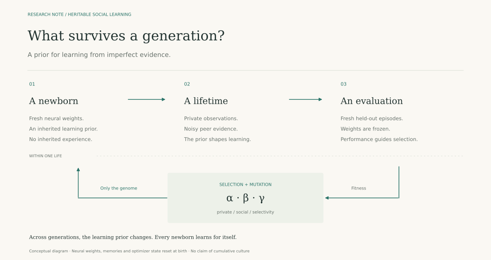
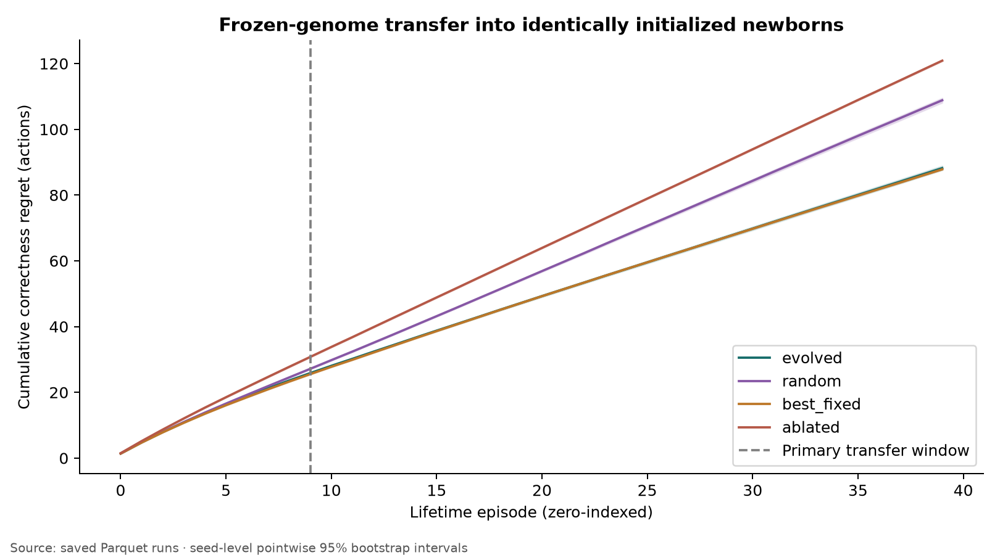

# Can a way of learning be inherited?

*On social information, selection, and a small experiment in artificial agents.*

**Research idea: Avani Gupta. This article was generated by OpenAI Codex from her idea, project brief, writing references, and experimental results.**

Imagine learning a skill from someone more experienced than you. You watch what they do, try it yourself, and gradually discover when their advice helps. Some lessons carry over easily. Others depend on circumstances that have already changed.

Learning from that person involves a second kind of learning: deciding how much to trust them.

I have been thinking about where that ability should come from in artificial agents. We can specify a rule ourselves. We can let an agent develop one through experience. We can also ask whether selection, operating across many generations, could discover a useful starting point for learning from others.

**Could an agent inherit a bias about how to learn, while still having to acquire its own experience?**

In an [earlier post](https://avani17101.substack.com/p/demystifying-learning-as-identification), I explored learning as recognizing patterns in the world. This question takes that thought one level further. The usefulness of different ways of learning may itself have structure. Observing others helps in some circumstances; relying on our own evidence helps in others. A useful learner needs some way to navigate that distinction.

An artificial population gives us a small setting in which to test whether selection can shape such a tendency.

*Two timescales: experience changes a learner within its life; selection changes the prior inherited by its descendants.*

The first experiment is intentionally modest. Each agent receives a three-number genome. These numbers influence the relative strength of private evidence, social evidence, and selectivity toward a noisy cue about a peer's reliability.

Every newborn gets a fresh neural network. It receives no parental weights, memories, or training history. Only the genome crosses the generation boundary. This separation matters: if descendants perform better, the explanation must involve the inherited learning prior and their subsequent experience.

Within a lifetime, the agent faces a hidden state and receives an imperfect private observation. It also sees a delayed, noisy signal from a peer. The peer can help, but copying it can also lead the agent astray. The genome shapes how these sources influence learning.

Before introducing evolution, I wanted to establish that this was a meaningful information problem. In one analytical regime, private information alone and blind copying each give 70% accuracy. Combining the two sources with the noisy reliability cue gives a Bayesian observer about 80.2%. Neither source is an oracle. There is something useful to learn about combining them.

The neural experiment then asks whether selection can discover a useful prior for this task. Agents learn, are evaluated on fresh episodes, and contribute their genomes to the next generation according to performance. Their descendants start again with new neural weights.

Across 20 independent runs, each with 32 agents and 50 generations, evolved priors helped newborns learn compared with random priors. They also improved on the individual-only condition. On average, the evolved prior saved about 1.30 mistakes over the first 100 decisions compared with a random prior, averaged over the held-out environments.

That is evidence for a limited claim: selection found a useful learning bias in this small family of strategies.

A stronger comparison asks whether evolution finds something a well-tuned fixed strategy misses. Here the answer remains uncertain. Over 400 decisions, the evolved prior incurred about 88.20 cumulative mistakes; the tuned fixed prior incurred 87.83. The paired confidence interval includes no difference. Evolution has not established an advantage over that baseline.

*Fresh networks, matched initial weights and task samples. Lower cumulative regret is better. Shading shows uncertainty across the 20 independent runs. The evolved and tuned fixed curves are close.*

There is a useful lesson in that outcome. A prior can be beneficial without requiring a special explanation for how it was found. In this prototype, evolutionary search is one way of selecting learning parameters. Comparing it with a strong fixed strategy keeps that distinction visible.

The experiment also reveals a weakness. When peer information becomes uninformative outside the training distribution, the evolved prior continues to trust it enough to damage performance. A tendency that helps under familiar conditions can become a liability when those conditions change. Robust trust would have to include the ability to discover when trust is no longer warranted.

One proposed control also needs careful interpretation. If we shuffle genomes among otherwise interchangeable newborns, the population still receives the same inherited genomes. Such a shuffle cannot establish whether preserving a particular parent–offspring lineage causes the benefit. To study that question, we need an intervention that changes the information actually transmitted.

These limitations help define the next experiment. The fixed search should cover a broader range of priors, with matched search budgets and the same selection objective. A Bayesian learner that retains the full observation history would provide another useful reference. A claim about lineage would require a genuine transmission intervention.

I have collected these questions into a [research checklist](../../docs/RESEARCH_ROADMAP.md), including the controls to establish before introducing richer genomes or a channel for cultural transmission.

There are established ideas behind this direction: the Baldwin effect, evolved learning rules, and social-learning strategies. The purpose here is to isolate a small mechanism that can be tested. A three-number genome is enough to ask whether something useful is inherited; it is much too small an experiment to establish cumulative culture.

What interests me is the possibility of connecting the two timescales more carefully. Experience tells an agent something about the world it encounters. Selection might shape the starting assumptions with which its descendants approach their own experience. Social information makes that interaction especially interesting, because learning well depends partly on deciding whose evidence to use.

For now, I have a prototype, a useful transfer result, and an unresolved comparison against a strong baseline. That seems like a reasonable place to begin.

I would welcome related work, disagreements, and suggestions for a sharper test—especially ways to distinguish a useful inherited prior from ordinary parameter tuning.

---

*Method note, September 2026.* A code audit found that the original baseline screen reused its learning trajectories. This is fixed: learning, screening, and validation now use independent random streams, with a regression test guarding the split. Retuning selected the same baseline, and the complete 20-seed rerun reproduced the reported metrics. The original results are archived. Because the test set had already been examined, the rerun is a correction, not a new independent confirmation. Search-budget and selection-objective limitations remain.

[Code and reproducibility instructions](../README.md) · [Full results](../results/RESULTS.md) · [Registered design and amendments](../DESIGN.md)

Related reading: [Ha & Jeong (2023), social-learning strategies](https://proceedings.mlr.press/v202/ha23a.html); [Bhoopchand et al. (2023), few-shot imitation as cultural transmission](https://www.nature.com/articles/s41467-023-42875-2); [Gruau & Whitley (1993), learning and the Baldwin effect](https://doi.org/10.1162/evco.1993.1.3.213).
