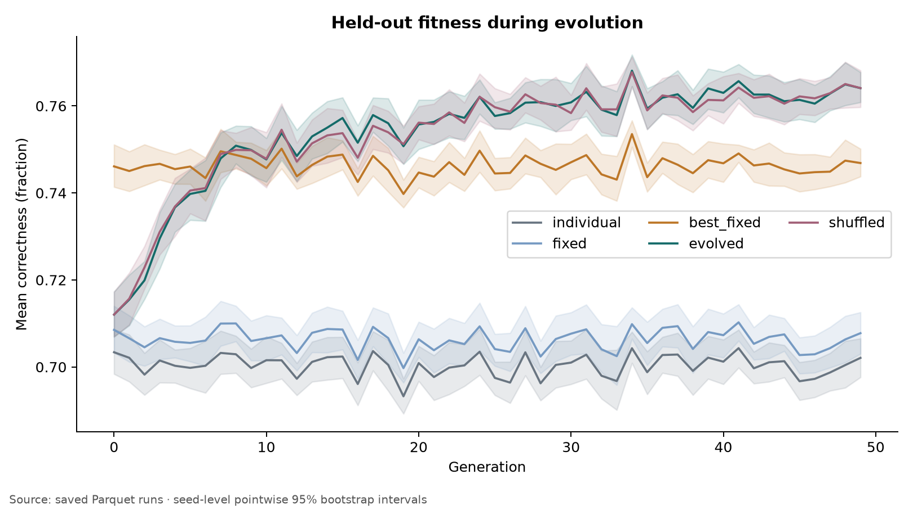
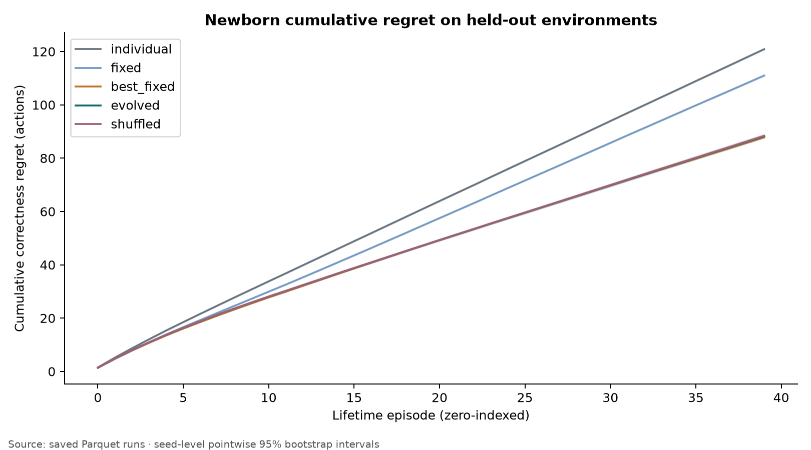
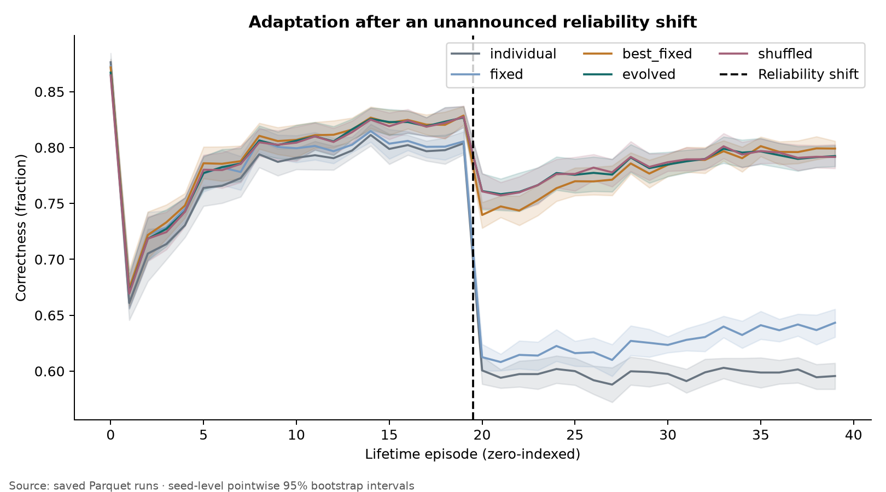
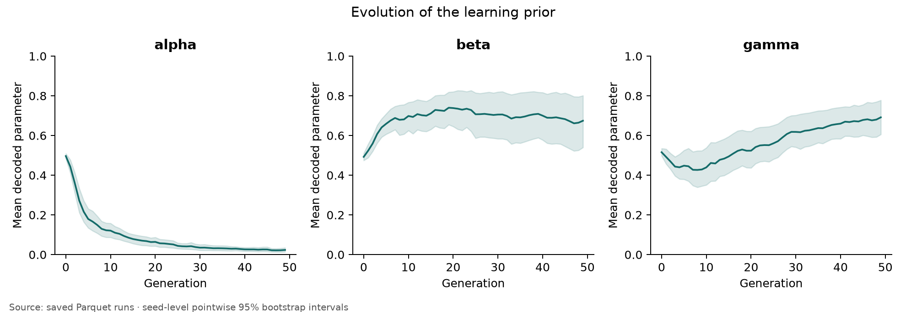
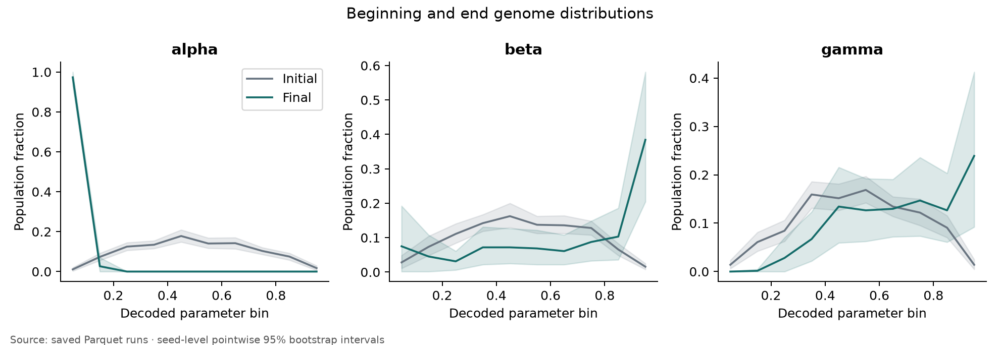
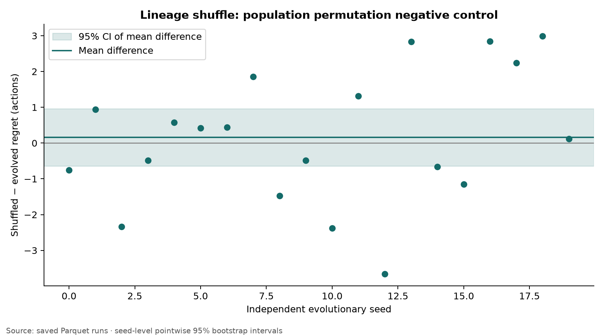
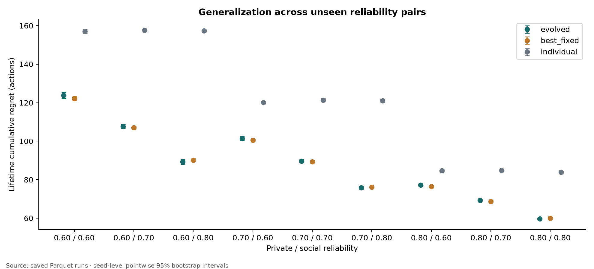
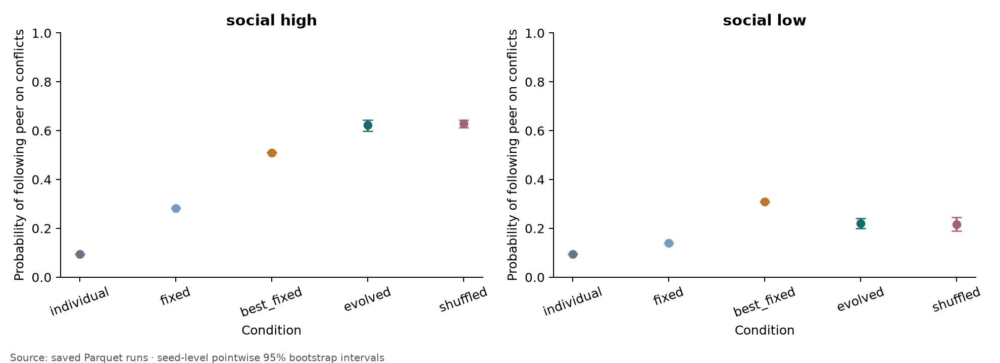

# Results: heritable social-learning strategy

Completed 20 independent evolutionary seeds; no failed or excluded seeds. H2 (evolved vs tuned fixed): **INCONCLUSIVE**. This is a minimal causal learning-prior prototype, not evidence of cumulative culture.

## 1. Experimental question
Does selecting a three-dimensional inherited learning prior improve learning in fresh neural agents?

## 2. Exact environment
Four equiprobable latent states, constant over ten steps; noisy private and delayed peer signals. Peer reliability is a .35/.95 mixture with an 85%-accurate type cue. Independent 65%-reliable private feedback arrives after acting. No hidden state enters the update. Analytical Bayesian accuracy at (.7,.7) is 80.208%, versus 70% for either source alone. The neural learner has no history accumulator and is not the analytical Bayes observer.

## 3. Conditions
Individual-only; fixed (.5,.5,.5); train/validation-tuned best-fixed; evolved; lineage-shuffled. Additional random, evolved beta=0, dimension-scrambled, no-social, near-perfect-social, and two specialization regimes.

## 4. Hyperparameters
```json
{
  "population_size": 32,
  "generations": 50,
  "elite_fraction": 0.25,
  "mutation_scale": 0.25,
  "learning_episodes": 24,
  "evaluation_episodes": 24,
  "test_episodes": 40,
  "episode_length": 10,
  "learning_rate": 0.15,
  "init_std": 0.05,
  "seeds": 20,
  "device": "cpu",
  "train": [
    [
      0.65,
      0.65
    ],
    [
      0.65,
      0.75
    ],
    [
      0.75,
      0.65
    ],
    [
      0.75,
      0.75
    ]
  ],
  "validation": [
    [
      0.625,
      0.625
    ],
    [
      0.625,
      0.725
    ],
    [
      0.625,
      0.775
    ],
    [
      0.725,
      0.625
    ],
    [
      0.725,
      0.725
    ],
    [
      0.725,
      0.775
    ],
    [
      0.775,
      0.625
    ],
    [
      0.775,
      0.725
    ],
    [
      0.775,
      0.775
    ]
  ],
  "test": [
    [
      0.6,
      0.6
    ],
    [
      0.6,
      0.7
    ],
    [
      0.6,
      0.8
    ],
    [
      0.7,
      0.6
    ],
    [
      0.7,
      0.7
    ],
    [
      0.7,
      0.8
    ],
    [
      0.8,
      0.6
    ],
    [
      0.8,
      0.7
    ],
    [
      0.8,
      0.8
    ]
  ]
}
```

Frozen baseline: [0.2, 0.8, 0.2]; validation fitness 0.7506. 27 candidates screened on training, nine on validation, each over five independent tuning seeds. Evolution evaluates 32 candidates per generation; search costs are not matched. See baseline.json and tuning.parquet.

## 5. Number of seeds
20 paired evolutionary seeds (0–19); agents are averaged within seeds. Tuning seeds are 1000–1004. All test environments and weights are paired across conditions.

## 6. Primary metric
Cumulative correctness regret against an omniscient state oracle; lower is better. Expected regret for the noisy scalar reward is 0.8 times correctness regret. Primary H4 uses the first 25% of the newborn lifetime.

## 7. Results
Seed-level cumulative regret, averaged across nine held-out environments:

- **individual**: mean 120.882, median 120.830, SD 0.448, 95% CI [120.694, 121.074].
- **fixed**: mean 110.991, median 111.005, SD 0.398, 95% CI [110.821, 111.159].
- **best_fixed**: mean 87.834, median 87.793, SD 0.371, 95% CI [87.681, 87.997].
- **evolved**: mean 88.198, median 88.047, SD 1.398, 95% CI [87.619, 88.835].
- **shuffled**: mean 88.356, median 88.476, SD 1.360, 95% CI [87.770, 88.911].
- **random**: mean 108.836, median 109.090, SD 1.566, 95% CI [108.165, 109.489].
- **ablated**: mean 120.882, median 120.830, SD 0.448, 95% CI [120.694, 121.074].
- **scrambled**: mean 104.025, median 104.198, SD 4.087, 95% CI [102.355, 105.913].

Early learning and newborn measurements (accuracy):

- individual: birth 0.251; first 10% 0.698; 25% 0.692; 50% 0.695; final ten episodes 0.700.
- fixed: birth 0.251; first 10% 0.725; 25% 0.727; 50% 0.726; final ten episodes 0.719.
- best_fixed: birth 0.251; first 10% 0.731; 25% 0.745; 50% 0.764; final ten episodes 0.799.
- evolved: birth 0.251; first 10% 0.727; 25% 0.741; 50% 0.764; final ten episodes 0.796.
- shuffled: birth 0.251; first 10% 0.727; 25% 0.741; 50% 0.764; final ten episodes 0.795.
- random: birth 0.251; first 10% 0.726; 25% 0.728; 50% 0.729; final ten episodes 0.728.

## 8. Statistical analysis
Paired bootstrap with 10,000 resamples at evolutionary-seed level. Positive differences favor evolved. H1/H2/H4 verdicts use Bonferroni 98.333% intervals; 95% intervals are also reported.

- H1, evolved vs individual: difference 32.684; median 32.497; SD 1.583; 95% CI [31.979, 33.343]; simultaneous CI [31.804, 33.479]; paired dz 20.646; positive/negative/tied seeds 20/0/0; **SUPPORTED**.
- H2, evolved vs best_fixed: difference -0.365; median -0.530; SD 1.357; 95% CI [-0.982, 0.191]; simultaneous CI [-1.131, 0.302]; paired dz -0.269; positive/negative/tied seeds 7/13/0; **INCONCLUSIVE**.
- H4, evolved vs random: difference 1.295; median 1.295; SD 0.251; 95% CI [1.191, 1.406]; simultaneous CI [1.168, 1.435]; paired dz 5.153; positive/negative/tied seeds 20/0/0; **SUPPORTED**.

## 9. Genome evolution
Population mean decoded parameters at the first and last generations:

- Generation 0: alpha=0.496 [0.483, 0.510]; beta=0.492 [0.474, 0.511]; gamma=0.516 [0.498, 0.535].
- Generation 49: alpha=0.024 [0.014, 0.034]; beta=0.674 [0.540, 0.795]; gamma=0.692 [0.606, 0.776].

H5 specialization: social-favoring minus private-favoring effective social weight = 11.453, 95% CI [5.601, 19.134]; **SUPPORTED** (exploratory). Only coefficient ratios are identifiable after loss normalization; absolute alpha/beta movements are not separate mechanisms.

## 10. Transfer results
All test metrics above use newborn networks and frozen selected genomes. Evolved and random arms start with identical neural weights and receive identical trajectories. Figure 7 shows the full learning curve. This measures an inherited learning bias, not inherited knowledge.

## 11. Lineage-shuffle results
Shuffled minus evolved regret 0.158, 95% CI [-0.639, 0.956]. **H3: INCONCLUSIVE** as a causal inheritance claim. A derangement changes every offspring slot assignment, but preserves inherited genomes. Identical-population permutation cannot distinguish lineage continuity from population-level selection.

## 12. Failure modes and controls

- no_social: individual minus evolved regret -68.253, 95% CI [-72.180, -63.219].
- perfect_social: individual minus evolved regret 44.164, 95% CI [41.856, 46.444].
- ablated minus evolved regret 32.684, 95% CI [31.979, 33.343].
- scrambled minus evolved regret 15.826, 95% CI [14.144, 17.779].

Shift recovery and secondary contrast:

- individual: 20/20 right-censored; median among observed recoveries not reached episodes.
- fixed: 20/20 right-censored; median among observed recoveries not reached episodes.
- best_fixed: 0/20 right-censored; median among observed recoveries 3.5 episodes.
- evolved: 0/20 right-censored; median among observed recoveries 3.0 episodes.
- shuffled: 0/20 right-censored; median among observed recoveries 3.0 episodes.
- Shift best-fixed minus evolved regret 0.280, 95% CI [-0.848, 1.275] (secondary).

Behavioral conflict probes (mean action probabilities, after learning):

- individual: follow private at low/high cue 0.716/0.716; follow peer at low/high cue 0.095/0.095; reject low-cue peer 0.905.
- fixed: follow private at low/high cue 0.645/0.540; follow peer at low/high cue 0.140/0.283; reject low-cue peer 0.860.
- best_fixed: follow private at low/high cue 0.473/0.337; follow peer at low/high cue 0.310/0.510; reject low-cue peer 0.690.
- evolved: follow private at low/high cue 0.543/0.265; follow peer at low/high cue 0.220/0.624; reject low-cue peer 0.780.
- shuffled: follow private at low/high cue 0.547/0.262; follow peer at low/high cue 0.215/0.628; reject low-cue peer 0.785.

A three-parameter search can be matched by a strong fixed strategy; selection noise and coarse baseline search both matter. Peers are exogenous; the population does not socially interact. Learning uses a noisy teaching signal and imitation, not reward-driven exploration. Beta=0 removes both social input and social updates, so its ablation is a channel-level intervention. The gamma cue gate is hand-designed; evolution selects its degree. The memory-limited policy can ignore repeated-state information that a Bayesian history model would exploit. The adaptation threshold can be easy when pre-shift performance is low. No endpoint was changed after inspecting final outcomes.

## 13. Interpretation
The primary comparison does not establish an advantage over the tuned fixed strategy. A useful evolved bias relative to random genomes would establish only that selection found a better prior in this small family. Neither a positive transfer result nor lineage shuffling demonstrates cultural transmission.

## 14. Next experiment
Use a denser fixed-strategy search and a Bayesian-history reference under the same learning budget; replace the lineage permutation with an explicitly randomized parent-genome transmission intervention if a lineage claim is needed. Do not proceed to a richer developmental genome until the current control limitations are resolved.

## Provenance and reuse
NumPy RNG/arrays, PyTorch autograd/SGD, SciPy bootstrap/sigmoid, Pandas/PyArrow Parquet and Matplotlib plotting were reused. Only environment, reproduction and task-specific metrics are custom. Each source row links to a config hash and full source snapshot. Source hash: `5d25bad7081c0ef2dc034fb776995616ee0874c9b119229c8cec94b058fe5783`. Clean snapshot Git SHA: `b899483ec6d448e24a0fe2bf227207a70b9f15d1`. An isolated Git bundle stores the exact executed source without committing the working project. Raw rows are in seed folders; derived seed metrics/statistics are in analysis/.

## Figures


















## Final hypothesis classifications

- H1: **SUPPORTED**
- H2: **INCONCLUSIVE**
- H3: **INCONCLUSIVE**
- H4: **SUPPORTED**
- H5: **SUPPORTED** (exploratory)
