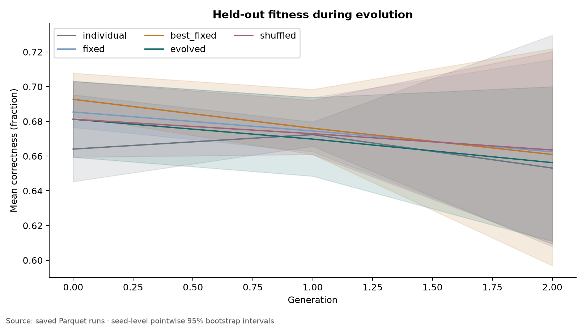
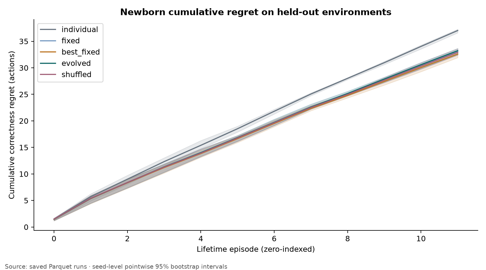
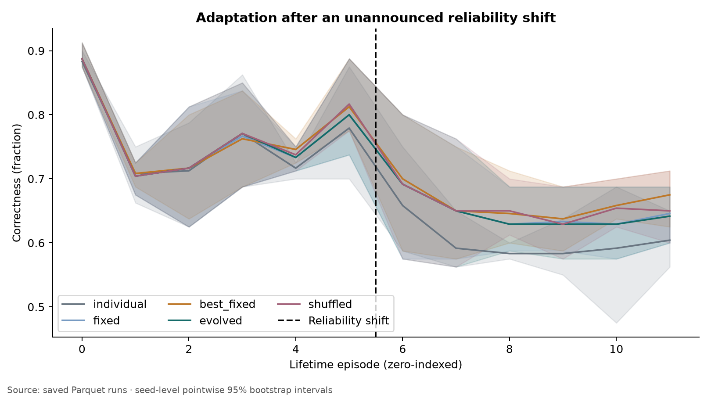
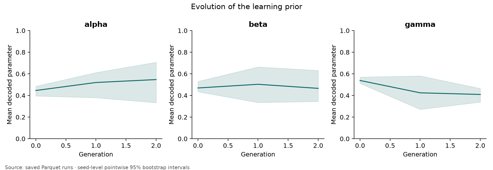
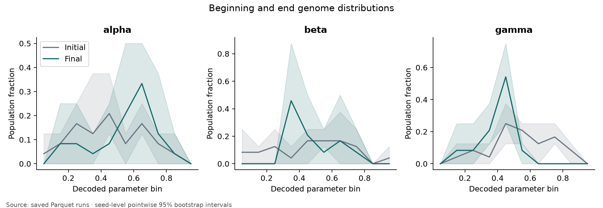
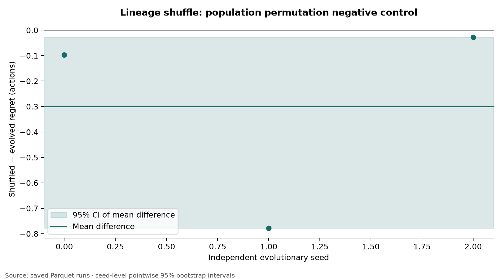
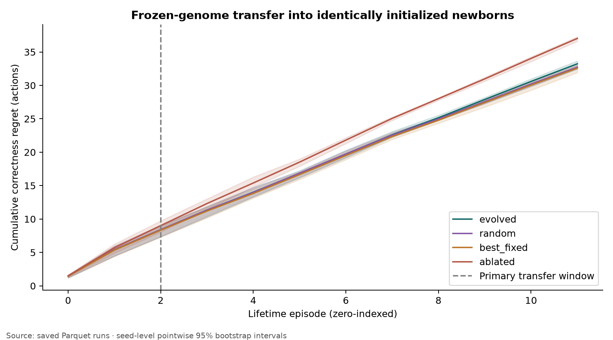
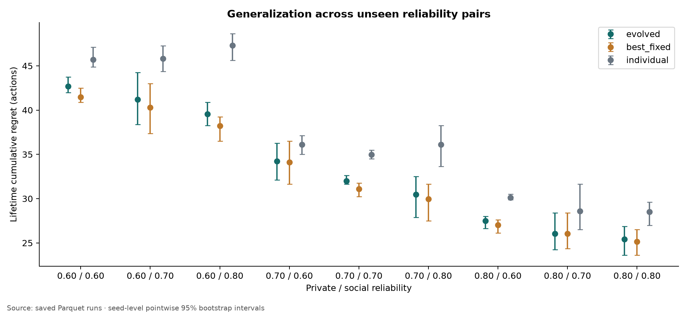
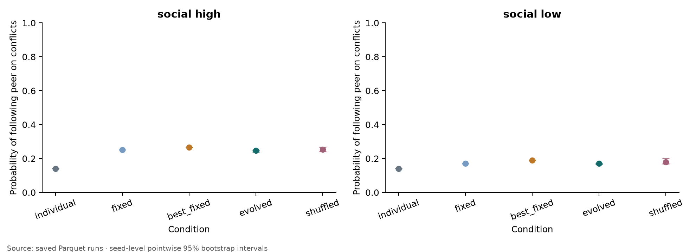

# Results: heritable social-learning strategy

Completed 3 independent evolutionary seeds; no failed or excluded seeds. H2 (evolved vs tuned fixed): **NOT SUPPORTED**. This is a minimal causal learning-prior prototype, not evidence of cumulative culture.

## 1. Experimental question
Does selecting a three-dimensional inherited learning prior improve learning in fresh neural agents?

## 2. Exact environment
Four equiprobable latent states, constant over ten steps; noisy private and delayed peer signals. Peer reliability is a .35/.95 mixture with an 85%-accurate type cue. Independent 65%-reliable private feedback arrives after acting. No hidden state enters the update. Analytical Bayesian accuracy at (.7,.7) is 80.208%, versus 70% for either source alone. The neural learner has no history accumulator and is not the analytical Bayes observer.

## 3. Conditions
Individual-only; fixed (.5,.5,.5); train/validation-tuned best-fixed; evolved; lineage-shuffled. Additional random, evolved beta=0, dimension-scrambled, no-social, near-perfect-social, and two specialization regimes.

## 4. Hyperparameters
```json
{
  "population_size": 8,
  "generations": 3,
  "elite_fraction": 0.25,
  "mutation_scale": 0.25,
  "learning_episodes": 8,
  "evaluation_episodes": 8,
  "test_episodes": 12,
  "episode_length": 10,
  "learning_rate": 0.15,
  "init_std": 0.05,
  "seeds": 3,
  "device": "cpu",
  "train": [
    [
      0.65,
      0.65
    ],
    [
      0.65,
      0.75
    ],
    [
      0.75,
      0.65
    ],
    [
      0.75,
      0.75
    ]
  ],
  "validation": [
    [
      0.625,
      0.625
    ],
    [
      0.725,
      0.775
    ],
    [
      0.775,
      0.725
    ]
  ],
  "test": [
    [
      0.6,
      0.6
    ],
    [
      0.6,
      0.7
    ],
    [
      0.6,
      0.8
    ],
    [
      0.7,
      0.6
    ],
    [
      0.7,
      0.7
    ],
    [
      0.7,
      0.8
    ],
    [
      0.8,
      0.6
    ],
    [
      0.8,
      0.7
    ],
    [
      0.8,
      0.8
    ]
  ]
}
```

Frozen baseline: [0.2, 0.2, 0.2]; validation fitness 0.6353. 27 candidates screened on training, nine on validation, each over five independent tuning seeds. Evolution evaluates 32 candidates per generation; search costs are not matched. See baseline.json and tuning.parquet.

## 5. Number of seeds
3 paired evolutionary seeds (0–2); agents are averaged within seeds. Tuning seeds are 1000–1004. All test environments and weights are paired across conditions.

## 6. Primary metric
Cumulative correctness regret against an omniscient state oracle; lower is better. Expected regret for the noisy scalar reward is 0.8 times correctness regret. Primary H4 uses the first 25% of the newborn lifetime.

## 7. Results
Seed-level cumulative regret, averaged across nine held-out environments:

- **individual**: mean 37.028, median 37.208, SD 0.374, 95% CI [36.597, 37.278].
- **fixed**: mean 33.134, median 33.431, SD 0.612, 95% CI [32.431, 33.542].
- **best_fixed**: mean 32.593, median 32.861, SD 0.589, 95% CI [31.917, 33.000].
- **evolved**: mean 33.227, median 33.542, SD 0.657, 95% CI [32.472, 33.667].
- **shuffled**: mean 32.926, median 32.764, SD 0.647, 95% CI [32.375, 33.639].
- **random**: mean 32.727, median 32.708, SD 0.292, 95% CI [32.444, 33.028].
- **ablated**: mean 37.028, median 37.208, SD 0.374, 95% CI [36.597, 37.278].
- **scrambled**: mean 33.097, median 33.319, SD 0.421, 95% CI [32.611, 33.361].

Early learning and newborn measurements (accuracy):

- individual: birth 0.235; first 10% 0.850; 25% 0.700; 50% 0.691; final ten episodes 0.687.
- fixed: birth 0.214; first 10% 0.854; 25% 0.721; 50% 0.720; final ten episodes 0.722.
- best_fixed: birth 0.214; first 10% 0.856; 25% 0.722; 50% 0.722; final ten episodes 0.728.
- evolved: birth 0.214; first 10% 0.854; 25% 0.721; 50% 0.719; final ten episodes 0.722.
- shuffled: birth 0.214; first 10% 0.851; 25% 0.720; 50% 0.720; final ten episodes 0.725.
- random: birth 0.214; first 10% 0.854; 25% 0.719; 50% 0.719; final ten episodes 0.727.

## 8. Statistical analysis
Paired bootstrap with 10,000 resamples at evolutionary-seed level. Positive differences favor evolved. H1/H2/H4 verdicts use Bonferroni 98.333% intervals; 95% intervals are also reported.

- H1, evolved vs individual: difference 3.801; median 3.667; SD 0.282; 95% CI [3.611, 4.125]; simultaneous CI [3.611, 4.125]; paired dz 13.477; positive/negative/tied seeds 3/0/0; **SUPPORTED**.
- H2, evolved vs best_fixed: difference -0.634; median -0.667; SD 0.069; 95% CI [-0.681, -0.556]; simultaneous CI [-0.681, -0.556]; paired dz -9.258; positive/negative/tied seeds 0/3/0; **NOT SUPPORTED**.
- H4, evolved vs random: difference 0.032; median 0.042; SD 0.042; 95% CI [-0.014, 0.069]; simultaneous CI [-0.014, 0.069]; paired dz 0.764; positive/negative/tied seeds 2/1/0; **INCONCLUSIVE**.

## 9. Genome evolution
Population mean decoded parameters at the first and last generations:

- Generation 0: alpha=0.446 [0.396, 0.485]; beta=0.469 [0.434, 0.530]; gamma=0.538 [0.512, 0.570].
- Generation 2: alpha=0.547 [0.333, 0.707]; beta=0.466 [0.345, 0.631]; gamma=0.409 [0.339, 0.465].

H5 specialization: social-favoring minus private-favoring effective social weight = 0.534, 95% CI [-0.134, 1.735]; **INCONCLUSIVE** (exploratory). Only coefficient ratios are identifiable after loss normalization; absolute alpha/beta movements are not separate mechanisms.

## 10. Transfer results
All test metrics above use newborn networks and frozen selected genomes. Evolved and random arms start with identical neural weights and receive identical trajectories. Figure 7 shows the full learning curve. This measures an inherited learning bias, not inherited knowledge.

## 11. Lineage-shuffle results
Shuffled minus evolved regret -0.301, 95% CI [-0.778, -0.028]. **H3: INCONCLUSIVE** as a causal inheritance claim. A derangement changes every offspring slot assignment, but preserves inherited genomes. Identical-population permutation cannot distinguish lineage continuity from population-level selection.

## 12. Failure modes and controls

- no_social: individual minus evolved regret 0.458, 95% CI [-0.375, 1.250].
- perfect_social: individual minus evolved regret 6.292, 95% CI [4.125, 8.125].
- ablated minus evolved regret 3.801, 95% CI [3.611, 4.125].
- scrambled minus evolved regret -0.130, 95% CI [-0.347, 0.139].

Shift recovery and secondary contrast:

- individual: 2/3 right-censored; median among observed recoveries 3.0 episodes.
- fixed: 2/3 right-censored; median among observed recoveries 3.0 episodes.
- best_fixed: 1/3 right-censored; median among observed recoveries 3.0 episodes.
- evolved: 2/3 right-censored; median among observed recoveries 3.0 episodes.
- shuffled: 2/3 right-censored; median among observed recoveries 3.0 episodes.
- Shift best-fixed minus evolved regret -1.167, 95% CI [-1.625, -0.750] (secondary).

Behavioral conflict probes (mean action probabilities, after learning):

- individual: follow private at low/high cue 0.579/0.579; follow peer at low/high cue 0.140/0.140; reject low-cue peer 0.860.
- fixed: follow private at low/high cue 0.534/0.485; follow peer at low/high cue 0.170/0.252; reject low-cue peer 0.830.
- best_fixed: follow private at low/high cue 0.512/0.467; follow peer at low/high cue 0.190/0.266; reject low-cue peer 0.810.
- evolved: follow private at low/high cue 0.535/0.489; follow peer at low/high cue 0.171/0.246; reject low-cue peer 0.829.
- shuffled: follow private at low/high cue 0.525/0.480; follow peer at low/high cue 0.179/0.254; reject low-cue peer 0.821.

A three-parameter search can be matched by a strong fixed strategy; selection noise and coarse baseline search both matter. Peers are exogenous; the population does not socially interact. Learning uses a noisy teaching signal and imitation, not reward-driven exploration. Beta=0 removes both social input and social updates, so its ablation is a channel-level intervention. The gamma cue gate is hand-designed; evolution selects its degree. The memory-limited policy can ignore repeated-state information that a Bayesian history model would exploit. The adaptation threshold can be easy when pre-shift performance is low. No endpoint was changed after inspecting final outcomes.

## 13. Interpretation
The primary comparison does not establish an advantage over the tuned fixed strategy. A useful evolved bias relative to random genomes would establish only that selection found a better prior in this small family. Neither a positive transfer result nor lineage shuffling demonstrates cultural transmission.

## 14. Next experiment
Use a denser fixed-strategy search and a Bayesian-history reference under the same learning budget; replace the lineage permutation with an explicitly randomized parent-genome transmission intervention if a lineage claim is needed. Do not proceed to a richer developmental genome until the current control limitations are resolved.

## Provenance and reuse
NumPy RNG/arrays, PyTorch autograd/SGD, SciPy bootstrap/sigmoid, Pandas/PyArrow Parquet and Matplotlib plotting were reused. Only environment, reproduction and task-specific metrics are custom. Each source row links to a config hash and full source snapshot. Source hash: `53910184775e12170425b12a0150e72a0d05e44b7afc704852286efc3c98efa6`. Base Git SHA: `02a89eeb355eeb0ae290ecd7ebc1931636120f9b`. The content snapshot, rather than the base commit alone, identifies executed code. Raw rows are in seed folders; derived seed metrics/statistics are in analysis/.

## Figures



















## Final hypothesis classifications

- H1: **SUPPORTED**
- H2: **NOT SUPPORTED**
- H3: **INCONCLUSIVE**
- H4: **INCONCLUSIVE**
- H5: **INCONCLUSIVE** (exploratory)
